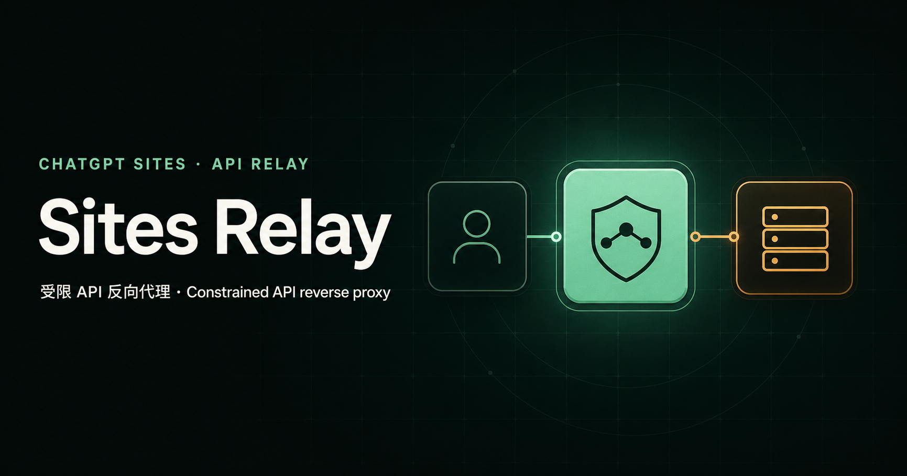

# Sites Relay

English | [Chinese](docs/README.zh-CN.md)



Sites Relay is a constrained relay for one fixed upstream, built for ChatGPT Sites. It provides a JSON/SSE API relay and an optional read-only static web mirror. It never accepts arbitrary client-supplied target URLs.

## Scope

The primary API relay is designed for JSON APIs and Server-Sent Events (SSE), including AI APIs with streaming responses. The upstream origin, proxy access token, method-path policy, query policy, and upstream credentials are controlled by server-side runtime values.

The optional static web mirror serves sanitized HTML, rewritten CSS, images, and fonts from the same fixed upstream. It is disabled by default, supports only `GET` and `HEAD`, and removes scripts, forms, cookies, inline styles, embedded content, and external resources. See [`docs/static-web-mirror.md`](docs/static-web-mirror.md) for its complete contract.

This version intentionally does not provide:

- arbitrary URL forwarding
- execution of upstream JavaScript, SVG, XML, forms, or other active web content
- WebSocket, CONNECT, TCP, or UDP tunneling
- file uploads, unrestricted redirects, or client `Authorization` forwarding

See [`docs/web-compatibility-direction.md`](docs/web-compatibility-direction.md) for the proposed architecture that lets authenticated users enter any public URL with JavaScript, API, cookie, and form compatibility. It uses a separate remote-browser service and does not change the current API relay contract.

## Quick start

Node.js 22.13 or later is required.

```powershell
Copy-Item .env.example .env.local
npm install
npm run dev
```

Edit `.env.local`, then open `http://localhost:3000`. The runtime panel reports configuration state only; it does not probe the upstream.

## Configuration

This is the canonical runtime configuration contract. Do not put secrets in `.openai/hosting.json`, `NEXT_PUBLIC_*`, or source code.

| Variable | Required | Description |
| --- | --- | --- |
| `PROXY_UPSTREAM_ORIGIN` | Yes | One HTTPS origin using a DNS hostname; no path, query, non-443 port, IP literal, or embedded credentials. |
| `PROXY_ACCESS_TOKEN` | Yes | A random 32–256 character base64url value; clients send it in `x-proxy-token`. |
| `PROXY_ALLOWED_ROUTES` | Yes | Comma-separated `METHOD:/path` rules, such as `GET:/v1/models,POST:/v1/responses`. Both the method and path prefix must match. |
| `PROXY_ALLOWED_QUERY_KEYS` | No | Exact query parameter names allowed upstream, comma-separated; an empty value denies every query parameter. |
| `PROXY_ALLOWED_ORIGINS` | No | Exact HTTPS origins allowed for cross-origin calls; HTTP is limited to loopback development origins, and same-origin requests need no entry. |
| `PROXY_UPSTREAM_AUTHORIZATION` | No | Complete upstream `Authorization` value injected by the server; printable ASCII only, up to 4096 characters. |
| `WEB_RELAY_ENABLED` | No | Enables the optional static web mirror at `/web/*`; defaults to `false`. |
| `WEB_RELAY_ALLOWED_PATH_PREFIXES` | When enabled | Comma-separated upstream path prefixes available through the static mirror. |
| `WEB_RELAY_ALLOWED_QUERY_KEYS` | No | Exact query parameter names allowed through the static mirror; an empty value denies every query parameter. |

`.env.example` mirrors this contract. Manage production values through Sites runtime values.

## Request contract

The endpoint is `/api/proxy/*`. After the method-path policy passes, the proxy path is appended to the fixed upstream origin; every query parameter must be explicitly allowed. The client cannot change the upstream scheme, host, or port.

```bash
curl -N "$SITE_URL/api/proxy/v1/responses" \
  -H "x-proxy-token: $PROXY_ACCESS_TOKEN" \
  -H "Content-Type: application/json" \
  --data '{"model":"your-model","input":"Hello"}'
```

Request limits:

- Forwarded methods: `GET`, `HEAD`, and `POST`; `OPTIONS` is handled locally for CORS preflight and never forwarded upstream.
- The method and path must match `PROXY_ALLOWED_ROUTES`; query parameters are denied by default.
- `POST` bodies must be non-empty, valid UTF-8 JSON, no larger than 1 MiB, and not compressed.
- Forwarded request headers: `Accept`, `Content-Type`, `Last-Event-ID`, and a validated `Idempotency-Key`.
- Client `Authorization`, cookies, identity headers, Cloudflare headers, and forwarding-chain headers never reach the upstream.
- Upstream responses are limited to `application/json`, `application/*+json`, and `text/event-stream`.
- Upstream 3xx responses are rejected and never followed automatically.
- The upstream connection wait is limited to 15 seconds; JSON is limited to 8 MiB/60 seconds and SSE to 64 MiB/15 minutes.

Response bodies stream through without buffering an entire SSE response first. A streamed response is terminated if it crosses its byte or time limit.

## Static web mirror

The optional `/web/*` surface is a read-only mirror of the same configured upstream, not an arbitrary-URL web proxy. It deliberately sacrifices JavaScript, cookies, and forms to keep untrusted upstream code out of the Sites origin.

Read [`docs/static-web-mirror.md`](docs/static-web-mirror.md) before enabling it. Keep deployments that expose this surface protected by Sites access control.

## Status and errors

`GET /api/health` returns a secret-free configuration summary:

- `setup_required`: required runtime values are missing
- `invalid`: values are present but invalid
- `ready`: configuration passed static validation, while upstream reachability remains `not_checked`

`ready` returns HTTP 200; `setup_required` and `invalid` return HTTP 503. `OPTIONS` is reported separately as the local preflight method, not as a forwarded method.

API errors use stable English error codes. Common errors include:

| Status | Code | Meaning |
| --- | --- | --- |
| 503 | `proxy_not_configured` | Required configuration is missing. |
| 503 | `proxy_invalid_config` | Configuration validation failed. |
| 401 | `proxy_unauthorized` | The proxy access token is invalid. |
| 403 | `origin_not_allowed` | The browser origin is not allowed. |
| 403 | `route_not_allowed` | The method-path pair is outside the policy. |
| 403 | `query_not_allowed` | A query parameter is outside the policy. |
| 413 | `payload_too_large` | The body exceeds 1 MiB. |
| 502 | `upstream_unavailable` | The upstream request could not complete. |
| 502 | `upstream_redirect_blocked` | The upstream attempted to redirect. |
| 502 | `unsupported_upstream_content_type` | The upstream returned a disallowed media type. |
| 502 | `upstream_response_too_large` | The declared upstream response exceeds the relay limit. |
| 504 | `upstream_timeout` | The upstream did not answer before the connection timeout. |

## Security boundaries

The proxy fails closed: missing or invalid configuration stops forwarding. It authenticates before applying method-path policy, rebuilds upstream headers, separates proxy and upstream credentials, rejects multiply encoded path bypasses and response types that could execute as same-origin content, and marks every response `no-store`.

A fixed hostname cannot defend against malicious DNS behavior by the upstream domain owner. Configure only an upstream you control or trust, and enforce quotas and rate limits there. For a public deployment, the proxy access token does not replace platform access policy or upstream rate limiting.

## Repository skill

The repository includes a Codex Skill at `.agents/skills/operate-sites-relay/`. Future agents can invoke `$operate-sites-relay` to load the architecture, security contract, validation commands, and private Sites deployment workflow.

## Contributing

See [`docs/CONTRIBUTING.md`](docs/CONTRIBUTING.md) for the development setup, validation workflow, pull request checklist, and Conventional Commits rules.

## Deploy to Sites

1. Open this project in ChatGPT and build it with the built-in Sites capability.
2. Keep the first deployment owner-only.
3. Set all required runtime values in Sites, then save and deploy a new version.
4. Check `/api/health`, then call a side-effect-free allowed path. Treat the upstream as reachable only after a real request succeeds.

## Verification

```powershell
npm run typecheck
npm run lint
npm test
```

`npm test` runs the production build first.

After deployment, also verify:

- missing config, wrong tokens, out-of-policy paths, and invalid origins all fail as expected
- cookies, client `Authorization`, and identity headers do not reach the upstream
- JSON returns normally and the first SSE chunk arrives before the stream ends
- the API relay does not pass through HTML, redirects, or `Set-Cookie`
- when the static mirror is enabled, active content is removed and only allowed paths, queries, assets, and same-policy redirects remain
