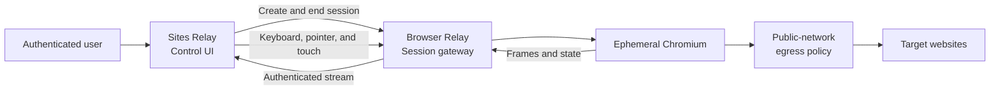

# Full web compatibility direction

English | [Chinese](./web-compatibility-direction.zh-CN.md)

> Status: Architecture proposal, not implemented. The current product contract remains in [`README.md`](../README.md).

## Goal

This direction lets authenticated users enter any public `http://` or `https://` URL and use the target site's JavaScript, API requests, cookies, and ordinary forms inside an isolated environment.

"Full compatibility" is an architectural target, not a guarantee for every site. A site's anti-automation controls, DRM, hardware requirements, browser-extension dependencies, or third-party sign-in restrictions may still prevent it from working.

## Architecture decision

Full compatibility should execute sites in a real browser instead of depending on HTML, CSS, and JavaScript text rewriting. The new component is provisionally called Browser Relay and is deployed separately from Sites Relay.

Sites Relay keeps two responsibilities:

1. Provide the control UI for URL entry, session state, and session termination.
2. Create short-lived Browser Relay sessions using the authenticated user's identity.

Browser Relay starts ephemeral browsers, executes target content, enforces network egress policy, and carries frames and input events to the control UI. Target-site code always runs in the remote browser sandbox, never inside the Sites page.

## Why not resource rewriting

Resource rewriting can cover static HTML, CSS, images, fonts, and some links, but it cannot reliably reproduce the complete behavior of a modern browser:

- JavaScript can construct `fetch`, XHR, module, Worker, and WebSocket URLs at runtime.
- Root-relative paths, dynamic imports, service workers, CSP, SRI, and redirects each require different handling.
- Mapping multiple target sites onto one proxy origin breaks the browser's original same-origin isolation.
- Cookie, `SameSite`, `Domain`, `Path`, storage partitioning, and third-party sign-in semantics are difficult to preserve through string rewriting.
- Upstream page code would run in the user's browser, expanding exposure of the control UI, access tokens, and user data.

A remote browser preserves native origin, cookie, redirect, script, and form semantics while moving untrusted code out of the Sites origin. The tradeoff is separate infrastructure for long-lived connections, browser processes, resource scheduling, and runtime isolation.

## Component responsibilities

| Component | Responsible for | Must not |
| --- | --- | --- |
| Sites Relay control UI | URL entry, user confirmation, session status, accessible input, explicit termination | Execute upstream HTML/JavaScript, store upstream cookies, or expose browser-control credentials |
| Session gateway | Identity binding, short-lived capabilities, concurrency and duration quotas, stream connections | Accept anonymous sessions or expose control APIs or long-lived credentials to page code |
| Browser worker | Chromium lifecycle, page execution, ephemeral profile, frames and input | Reuse browser contexts across users, use host networking, or retain profiles |
| Egress policy layer | Public-address enforcement, DNS and redirect revalidation, scheme and port policy, bandwidth limits | Rely only on frontend URL validation or a one-time DNS check |
| Observability and quota layer | Session IDs, resource usage, failure classes, abuse signals | Log full URL queries, form contents, cookies, page bodies, or user input |

## Domain and execution isolation

Use at least two origins:

- the Sites control origin, for example `relay.example.com`
- the Browser Relay isolation origin, for example `browser.example.net`

A separate origin is necessary but not sufficient. Browser Relay must not inject upstream DOM into the isolation-origin page. That origin carries only the trusted viewer shell, frame stream, and input channel. Target HTML, JavaScript, and cookies exist only inside remote Chromium.

The first version uses a separate browser context for every session. A production multi-tenant environment should prefer a separate process or container per session. Destroy the profile, memory, temporary files, and capabilities when the session ends or expires.

## Session lifecycle

1. The user authenticates in Sites Relay and enters a public HTTP(S) URL.
2. The Sites Relay server sends the user identity, initial URL, and requested quota to the session gateway. The browser never submits long-lived service credentials directly.
3. The gateway creates a short-lived session and uses a one-time handoff to establish a `Secure`, `HttpOnly` session on the isolation origin. Capabilities are not placed in persistently logged URLs.
4. A browser worker starts inside a restricted network namespace and reaches the target through the egress policy layer.
5. Target scripts, API requests, cookies, navigation, and forms run inside the remote browser with native browser semantics.
6. The viewer receives only frames, accessible state, and necessary audio, and sends constrained keyboard, pointer, and touch events.
7. When the user ends the session, remains disconnected beyond the grace period, or reaches the absolute lifetime, the gateway revokes capabilities and destroys the worker.

## Network and SSRF boundaries

"Any URL" means any public HTTP(S) target, not any network location. The following rules must be enforced at the browser's network layer:

- Initial navigation accepts only `http:` and `https:` and rejects `file:`, `ftp:`, `chrome:`, `javascript:`, and custom schemes.
- Reject IPv4 and IPv6 loopback, private, link-local, ULA, multicast, reserved, and cloud-metadata addresses.
- Reapply address policy on every DNS resolution, connection, and redirect. Application-level hostname checks alone do not stop DNS rebinding.
- Browser workers do not use host networking and cannot reach the host, container control plane, databases, or internal service networks.
- Do not accept user-supplied upstream proxies, `Authorization`, client certificates, or custom DNS.
- Apply hard limits to session concurrency, navigation rate, response size, bandwidth, CPU, memory, and total duration.

## JavaScript, APIs, cookies, and forms

- JavaScript is enabled in remote Chromium and cannot access Sites Relay DOM, storage, or credentials.
- `fetch`, XHR, modules, workers, and WebSockets are handled natively by the remote browser and pass through the same egress policy.
- Cookies and Web Storage remain in the current session profile. The first version does not persist them across sessions.
- Ordinary GET/POST forms can be submitted in the remote browser. Sites Relay does not read, copy, or log their contents.
- The first version disables file uploads, automatic downloads, clipboard reads, camera, microphone, geolocation, USB, Bluetooth, and notification permissions. Later capabilities require separate authorization, quota, and content-handling designs.
- Do not import cookies, passwords, extensions, or certificates from the user's local browser.

## Identity and capabilities

- Authentication is required to create, view, control, and terminate sessions.
- Capabilities are bound to the user, session, purpose, issue time, and expiry and cannot be reused across sessions.
- Viewer capabilities are separate from worker-management credentials; page code receives neither.
- Allow only a small number of concurrent sessions per user by default, with short idle and absolute timeouts.
- If public registration is added later, abuse response, blocking, quotas, cost ceilings, and legal review must be completed first.

## Deployment boundary

Browser Relay needs long-lived connections, a browser binary, process or container isolation, and controlled network egress. It is therefore deployed as a separate container service, while the current Sites deployment continues to host the control UI and constrained JSON/SSE API relay.

Minimum runtime boundaries for browser workers:

- Run as a non-root user with a read-only root filesystem and a limited `tmpfs` for the temporary profile.
- Keep the Chromium sandbox enabled; never use `--no-sandbox` in production.
- Use containers with seccomp, dropped capabilities, PID/memory/CPU/disk limits, and no host mounts.
- Keep the gateway and workers on an internal network; only the gateway exposes authenticated HTTPS/WSS endpoints.
- Use separate credentials for service-to-service traffic and manage production secrets through the deployment platform.

## Delivery phases

### Phase 0: threat model and single-session prototype

- Fix the attack surface, data flow, trust boundaries, and cost ceiling.
- Prove that egress policy blocks IPv4, IPv6, redirect, and DNS-rebinding bypasses.
- Complete URL navigation, frame transport, and input for one ephemeral Chromium session.

### Phase 1: authenticated MVP

- Add user identity, short-lived capabilities, termination, and timeout cleanup.
- Support JavaScript, APIs, session-only cookies, and ordinary forms.
- Disable file transfer and device permissions and enforce hard resource quotas.

### Phase 2: multi-user hardening

- Add per-session process or container isolation, queues, concurrency limits, and overload protection.
- Add content-free audit events, abuse detection, and operational alerts.
- Complete isolation, SSRF, session-hijacking, resource-exhaustion, and cross-user leakage tests.

### Phase 3: optional experience capabilities

- Evaluate encrypted profile persistence, controlled downloads, or file uploads only after separate designs.
- Evaluate a DOM assistance channel for demonstrated accessibility needs without injecting untrusted DOM into the control page.

## Acceptance criteria

Before a production trial, at minimum:

- A session can be created for any public HTTP(S) URL, while non-public targets fail before a network connection.
- JavaScript, same-origin API requests, cross-page navigation, session cookies, and ordinary forms work on tested sites.
- Loopback, RFC 1918, link-local, ULA, cloud-metadata, redirect, and DNS-rebinding cases cannot be reached.
- A target page cannot read the control origin, identity session, capabilities, or another user's session.
- Session termination and timeout revoke control channels and delete browser profiles and temporary files.
- Logs contain no full query strings, cookies, form values, page bodies, keyboard input, or screenshots.
- Resource limits remain effective for hostile pages and disconnected clients without affecting other sessions.

## Decisions required before implementation

1. Browser Relay deployment platform, isolation origin, and public-egress enforcement.
2. Whether frames use WebSocket streaming or WebRTC, plus the scope of audio and mobile input.
3. Production identity source, per-user concurrency, idle timeout, absolute lifetime, and cost ceiling.
4. Whether the first version disables downloads and uploads entirely and who owns later content scanning.
5. Whether the service remains owner/invite-only. Public registration requires a separate abuse and legal review.

## Relationship to the current project

This document records a future direction only and does not change current runtime behavior. The existing `/api/proxy/*` continues to use a fixed HTTPS upstream, method-path allowlisting, server-side authentication, and JSON/SSE response restrictions.

Future implementation should add a clearly separated Browser Relay service and control-plane integration. It must not bypass the existing security contract by adding an arbitrary `url` parameter to `/api/proxy/*`.
